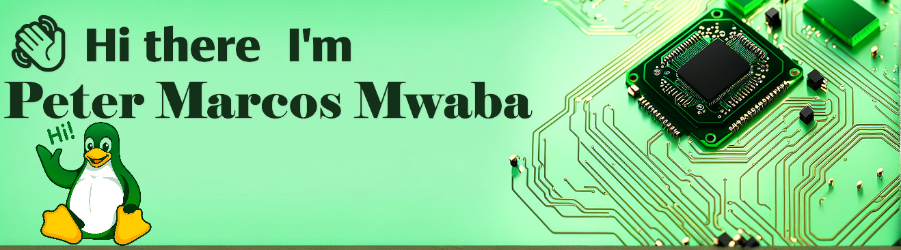

  

💻 Software Developer | 🔧 IT Support Specialist | 🇿🇲 Zambian Technologist

---

## 🧠 About Me

⠉⠉⠉⠉⠁⠀⠀⠀⠀⠒⠂⠰⠤⢤⣀⡀⠀⠀⠀⠀⠀⠀⠀⠀⠀⠀⠀⠀⠀⠀⠀⠀⠀⠀ 
⠀⠀⠀⠀⠀⠀⠀⠀⠀⠀⠀⠀⠀⠀⠀⠛⠻⢤⠀⠀⠀⠀⠀⠀⠀⠀⠀⠀⠀⠀⠀⠀⠀⠀ 
⠀⠠⠀⠐⠒⠒⠀⠀⠈⠉⠉⠉⠉⢉⣉⣉⣉⣙⡀⠀⠀⠀⠀⠀⠀⠀⠀⠀⠀⠀⠀⠀⠀⠀ 
⠀⠀⠀⠀⠀⠀⠀⢀⡀⠤⠒⠒⠉⠁⠀⠀⠀⠀⠳⣤⣀⣀⡀⠀⠀⠀⠀⠀⠀⠀⠀⠀⠀⠀ 
⠀⠀⠀⠀⠀⠀⠈⠀⠀⠀⠀⠀⠀⠀⠀⠀⠀⣠⣶⠛⠛⠉⠛⠛⠶⢦⣤⡐⢀⠀⠀⠀⠀⠀ 
⠀⠀⠀⠀⠀⠀⠀⠀⠀⠀⠀⠀⠀⠀⠀⠀⣰⡿⠁⠀⠀⠀⠀⠀⠀⠀⠈⠉⢳⣦⠀⠀⠀⠀ 
⠀⠀⠀⠀⠀⠀⠀⠀⠀⠀⠀⠀⠀⠀⠀⠀⣿⡇⠀⠀⠀⠀⠀⠀⠀⠀⠀⠀⠀⠉⠳⡤⠀⠀ 
⠀⠀⠀⠀⠀⠀⠀⠀⠀⠀⠀⠀⠀⠀⠀⠀⢹⣇⠀⠀⠀⠀⠀⠀⠀⠀⠀⠀⠀⠀⠀⠀⠀⠀ 
⠀⠀⠀⠀⠀⠀⠀⠀⠀⠀⠀⠀⠀⠀⠀⠀⠀⠙⢷⣤⣀⣀⠀⠀⠀⠀⠀⠀⠀⠀⠀⠀⠀⠀ 
⠀⠀⠀⠀⠀⠀⠀⠀⠀⠀⠀⠀⠀⠀⠀⠀⠀⠀⠀⠈⠉⠙⠛⠛⠳⠶⢶⣦⠤⣄⡀⠀⠀⠀ 
⠀⠀⠀⠀⠀⠀⠀⠀⠀⠀⠀⠀⠀⠀⠀⠀⠀⠀⠀⠀⠀⠀⠀⠀⠀⠀⠀⠉⠳⣄⠉⠑⢄⠀ 
⠀⠀⠀⠀⠀⠀⠀⠀⠀⠀⠀⠀⠀⠀⠀⠀⠀⠀⠀⠀⠀⠀⠀⠀⠀⠀⠀⠀⠀⠈⠳⡀⠀⠁ 
⠀⠀⠀⠀⠀⠀⠀⠀⠀⠀⠀⠀⠀⠀⠀⠀⠀⠀⠀⠀⠀⠀⠀⠀⠀⠀⠀⠀⠀⠀⠀⠱⡄⠀ 
⠀⠀⠀⠀⠀⠀⠀⠀⠀⠀⠀⠀⠀⠀⠀⠀⠀⠀⠀⠀⠀⠀⠀⠀⠀⠀⠀⠀⠀⠀⠀⠀⢰⠀ 
⠀⠀⠀⠀⠀⠀⠀⠀⠀⠀⠀⠀⠀⠀⠀⠀⠀⠀⠀⠀⠀⠀⠀⠀⠀⠀⠀⠀⠀⠀⠀⠀⠀⡄

  

<strong>🐧 Your Kali Linux Funboy</strong>

- 🚀 You can depend on me to help you build a system 😉  
- 🌍 I am Dev Based in: **Zambia, Lusaka** "Zambia ku chalo!"  
- 💬 Ask me about: React, Node.js, Supabase, Tailwind CSS, PostgreSQL, Java, Python, C++, C#, and Linux  
- 🎧 Favorite stack: **Green & Black tech with a clean UI feel**

---

## 🛠️ Tech Stack

  

**GitHub status:** _No status set_

## 🤝 Let's Connect

  
  
  
  
  

---

  <em>"Code with passion, support with purpose, and innovate with heart."</em>

<!-- STATUS:START -->
**GitHub status:** :tired_face: we getting there
<!-- STATUS:END -->

<!-- STATUS:START -->
**GitHub status:** :tired_face: we getting there
<!-- STATUS:END -->

<!-- STATUS:START -->
**GitHub status:** :tired_face: we getting there
<!-- STATUS:END -->

<!-- STATUS:START -->
**GitHub status:** :tired_face: we getting there
<!-- STATUS:END -->

<!-- STATUS:START -->
**GitHub status:** :tired_face: we getting there
<!-- STATUS:END -->

<!-- STATUS:START -->
**GitHub status:** :tired_face: we getting there
<!-- STATUS:END -->

<!-- STATUS:START -->
**GitHub status:** :tired_face: we getting there
<!-- STATUS:END -->

<!-- STATUS:START -->
**GitHub status:** :tired_face: we getting there
<!-- STATUS:END -->

<!-- STATUS:START -->
**GitHub status:** :tired_face: we getting there
<!-- STATUS:END -->

<!-- STATUS:START -->
**GitHub status:** :tired_face: we getting there
<!-- STATUS:END -->

<!-- STATUS:START -->
**GitHub status:** :tired_face: we getting there
<!-- STATUS:END -->

<!-- STATUS:START -->
**GitHub status:** :tired_face: we getting there
<!-- STATUS:END -->

<!-- STATUS:START -->
**GitHub status:** :tired_face: we getting there
<!-- STATUS:END -->

<!-- STATUS:START -->
**GitHub status:** :tired_face: we getting there
<!-- STATUS:END -->

<!-- STATUS:START -->
**GitHub status:** :tired_face: we getting there
<!-- STATUS:END -->

<!-- STATUS:START -->
**GitHub status:** :tired_face: we getting there
<!-- STATUS:END -->

<!-- STATUS:START -->
**GitHub status:** :tired_face: we getting there
<!-- STATUS:END -->

<!-- STATUS:START -->
**GitHub status:** :tired_face: we getting there
<!-- STATUS:END -->

<!-- STATUS:START -->
**GitHub status:** :tired_face: we getting there
<!-- STATUS:END -->

<!-- STATUS:START -->
**GitHub status:** :tired_face: we getting there
<!-- STATUS:END -->

<!-- STATUS:START -->
**GitHub status:** :tired_face: we getting there
<!-- STATUS:END -->
